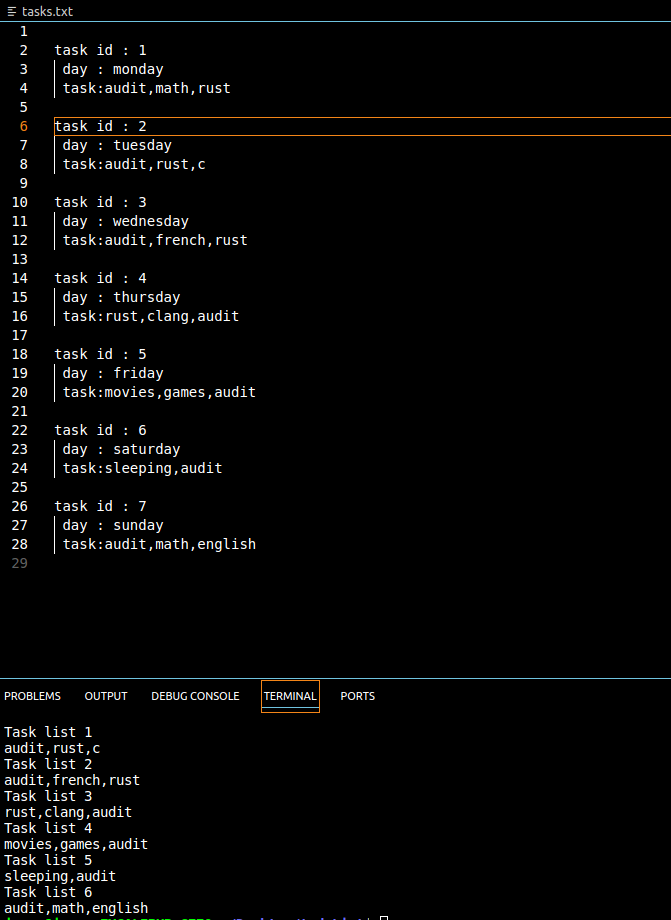

# todoList

This project creates a simple daily task list and caches it inside the tasks.txt file, feel free to enjoy or modify it without breaking license conditions (Note : Currently each daily task should consist of maximum 20 characters if you break this length program will be immediately shutdown).

## Getting Started(These steps are compatible with linux however you can build this project on other os as well!)

git clone https://github.com/Taneristique/TodoList.git 
cd TodoList  
gcc main.c -o main.sh  
chmod +w+r ./main.sh  
./main.sh  

## Screenshot 

